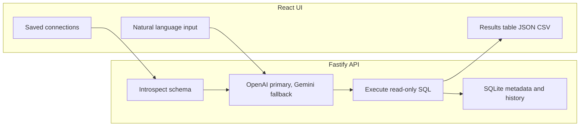

# HumanQuery

**Ask your database in plain English.** HumanQuery is a self-hosted web app that introspects your live schema, generates **read-only SQL** tuned to your dialect, runs it, and shows results—plus parallel snippets for **Prisma**, **TypeORM**, **Sequelize**, **SQLAlchemy**, and **Django ORM** so you can copy working code into your stack.

## Features

- **Natural language → SQL** grounded in your real tables, columns, and foreign keys
- **Execute and explore** results as table, JSON, CSV, or row count
- **Multi-ORM output** from the same question (learn SQL and your ORM side by side)
- **Connections** for PostgreSQL, MySQL, Microsoft SQL Server, and SQLite
- **Encrypted connection strings** at rest (AES-256-GCM); local metadata and query history in SQLite
- **Safety hints**: model is prompted for read-only queries, row limits, and an estimated risk label (`safe` / `moderate` / `destructive`)

## How it works



1. You save a database connection (connection string is encrypted on disk).
2. The backend introspects the schema (with configurable cache TTL).
3. Your question and schema DDL are sent to **your** OpenAI account first (Gemini is used automatically if OpenAI fails and a Gemini key is configured).
4. The app executes the generated SQL and returns formatted results; queries are logged to local history.

## Quick start

### Prerequisites

- Node.js 20+ recommended
- An [OpenAI API key](https://platform.openai.com/) for query generation (primary), and optionally a [Gemini API key](https://aistudio.google.com/) as fallback

### Backend

```bash
cd backend
cp .env.example .env
# Edit .env: set OPENAI_API_KEY (and optionally GEMINI_API_KEY for fallback), plus ENCRYPTION_KEY
npm install
npm run dev
```

The API listens on `http://localhost:3001` by default (`PORT`). Health check: `GET /api/health`.

### Frontend

```bash
cd frontend
cp .env.example .env
# Optional: set VITE_API_URL if the API is not on http://localhost:3001
npm install
npm run dev
```

Open the URL Vite prints (usually `http://localhost:5173`). Add a connection in the UI, then ask a question.

### Environment variables (backend)

| Variable | Required | Description |
|----------|----------|-------------|
| `OPENAI_API_KEY` | Yes* | OpenAI API key (primary LLM) |
| `GEMINI_API_KEY` | No** | Google Gemini; used if OpenAI fails, or alone if OpenAI is unset |
| `ENCRYPTION_KEY` | Yes | Secret used to encrypt stored connection strings |
| `OPENAI_MODEL` | No | Default `gpt-4.1` |

\* At least one of `OPENAI_API_KEY` or `GEMINI_API_KEY` (or `GOOGLE_API_KEY`) must be set.  
\** Recommended when using OpenAI so outages or rate limits can fall back to Gemini.
| `PORT` | No | Default `3001` |
| `MAX_ROWS` | No | Cap on rows returned (default `1000`, max `10000`) |
| `SCHEMA_CACHE_TTL_SECONDS` | No | Schema cache TTL (default `300`) |
| `CORS_ORIGIN` | No | CORS origin(s); default allows all in dev |

See [backend/.env.example](backend/.env.example).

### Production build

```bash
cd backend && npm run build && npm start
cd frontend && npm run build
```

Serve `frontend/dist` with any static host and point `VITE_API_URL` at your API when building the frontend.

## Security and trust

- **Generated SQL is executed** against the database you connect. Treat prompts like code: use **read-only database users** or replicas for exploration, especially on shared or production data.
- **Schema and questions** are sent to OpenAI (or Gemini if OpenAI fails and fallback is configured) when you run a query. Do not connect datasets you are not allowed to expose to a third-party API.
- **Connection strings** are encrypted at rest under `backend/data/humanquery.local.sqlite` using `ENCRYPTION_KEY`. Back up and protect that file and your `.env`.

This project does not replace a formal security review or database access policy.

## Stack

| Layer | Technology |
|-------|------------|
| Frontend | React 19, Vite, TypeScript, Tailwind CSS, DaisyUI |
| Backend | Fastify 5, TypeScript |
| Databases | `pg`, `mysql2`, `mssql`, `better-sqlite3` |
| LLM | `@ax-llm/ax`, OpenAI,Google GEMINI |

## Repository layout

- `backend/src/routes/` — HTTP API (connections, introspect, query, history)
- `backend/src/services/` — introspection, execution, LLM generation, formatting
- `frontend/src/` — UI and API client

## Contributing

Issues and pull requests are welcome. For frontend-only development notes, see [frontend/README.md](frontend/README.md).


## License

[MIT](LICENSE)
